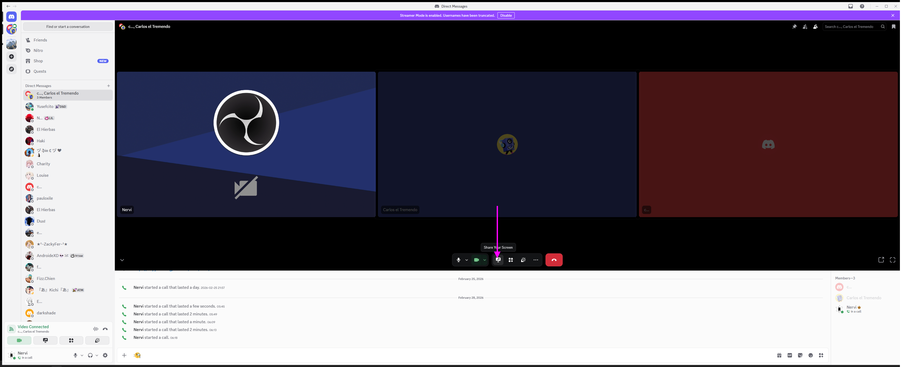
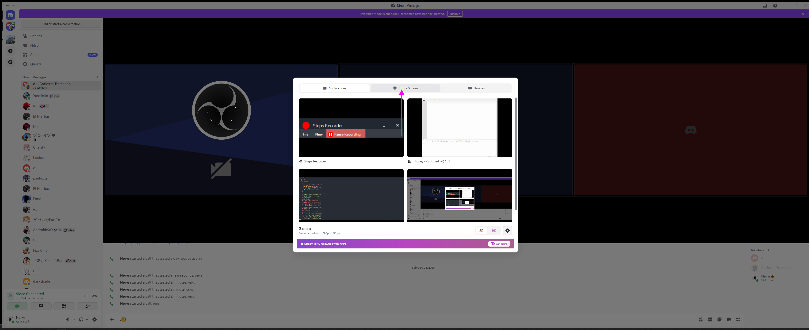
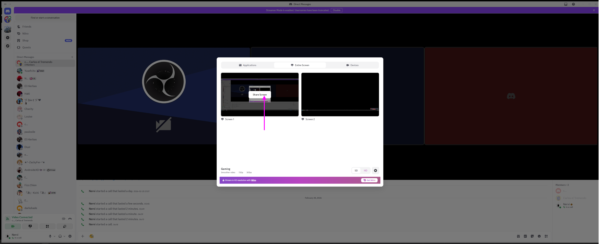
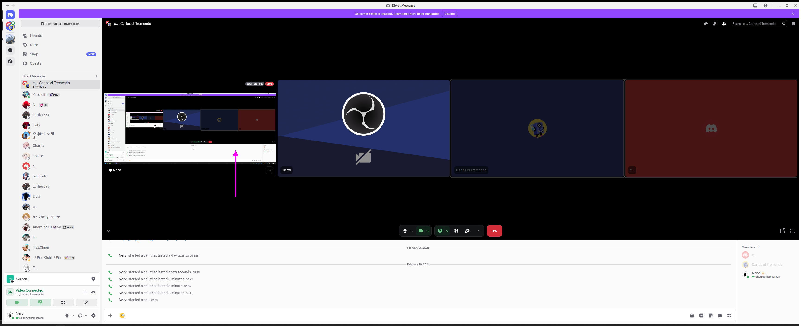
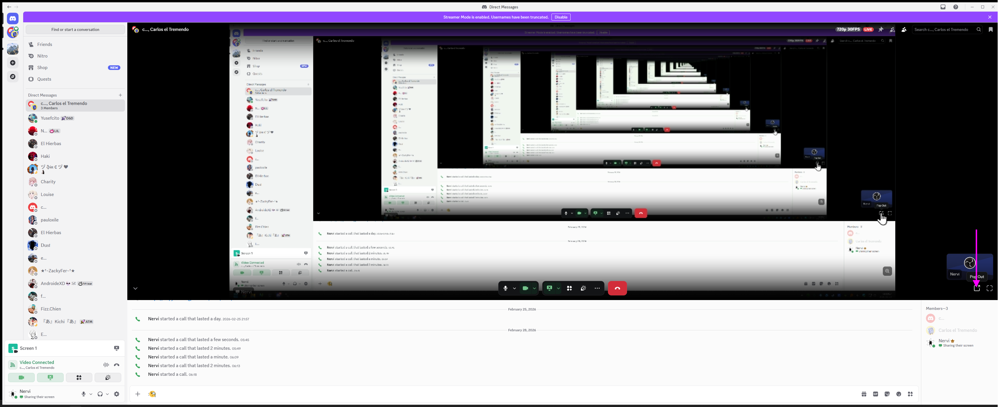
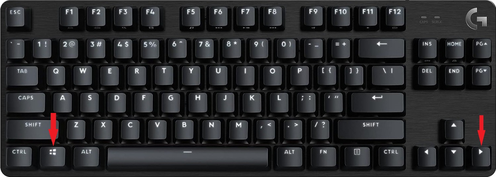
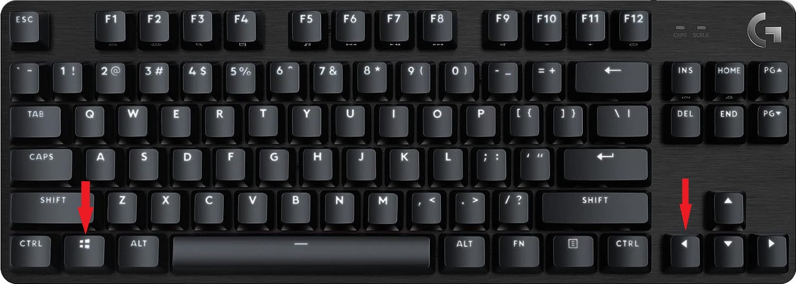
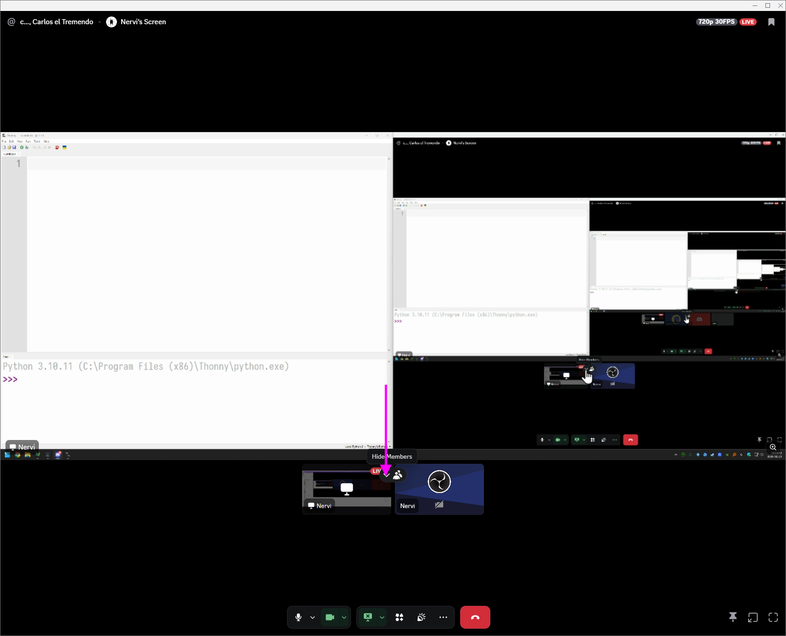

# Discord Guide

## Step 1: In Discord, Left Click on *Share Your Screen*
  

## Step 2: In Discord, Left Click on *Entire Screen*
  

## Step 3: In Discord, Left Click on *Share Screen*
  

## Step 4: In Discord, Left Click on *Nervi*
  

## Step 5: In Discord, Left Click on *Pop Out*
  

## Step 6: In Discord, press *Win+Right*
  

## Step 7: In Thonny, press *Win+Left*
  

## Step 8: In Discord, Left Click *Hide Members*
  
